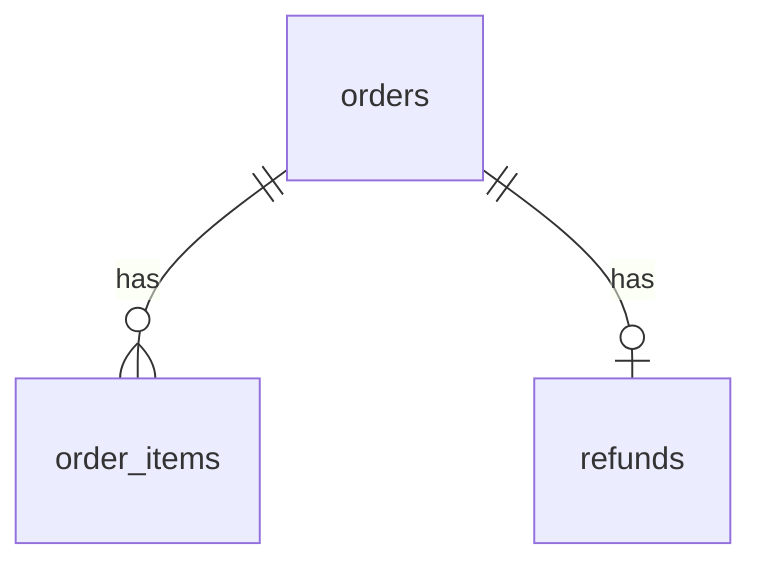

# 전체 ERD

> 테이블, 관계, 제약. 사람용. 세션에는 슬라이스 카드의 "스키마 발췌"로만 전달한다.

```mermaid
erDiagram
  orders ||--o{ order_items : has
  orders ||--o| refunds : has
```

## 테이블

### orders (예시)
| 컬럼 | 타입 | 제약 |
|---|---|---|
| id | uuid | PK |
| status | OrderStatus (enum) | NOT NULL |
